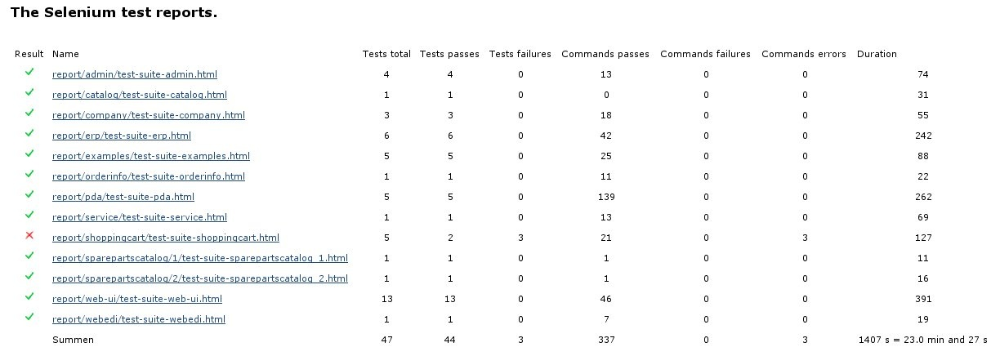
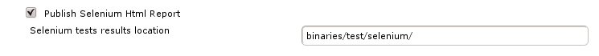

# seleniumhtmlreport

This plugin visualizes the results of selenium tests.

# Description

The seleniumhtmlreport plugin scans the selenium test results directory
for html files created by selenium tests and creates an overview of the
executed tests.

All html result files will be copied into the subdirectory
"seleniumReports" of the build root directory.

All results will be read from the html result files. In the overview is
for each html result file a link to it.

## Configuration

If you activate the Post-Build-Action "Publish Selenium Html Report" you
can insert the location of your selenium test results into the text
input box with the label "Selenium tests results location". Insert a
location relative to your workspace.

# Feedback

This plugin is developed and maintained by Marco Machmer with kind
support from [Abas Software AG](http://www.abas.de/). Please feel free
to contact me for feedback. If you have suggestions for new features or
you've found a bug, please use the [issue
tracker](http://issues.jenkins-ci.org/browse/JENKINS/component/15781).